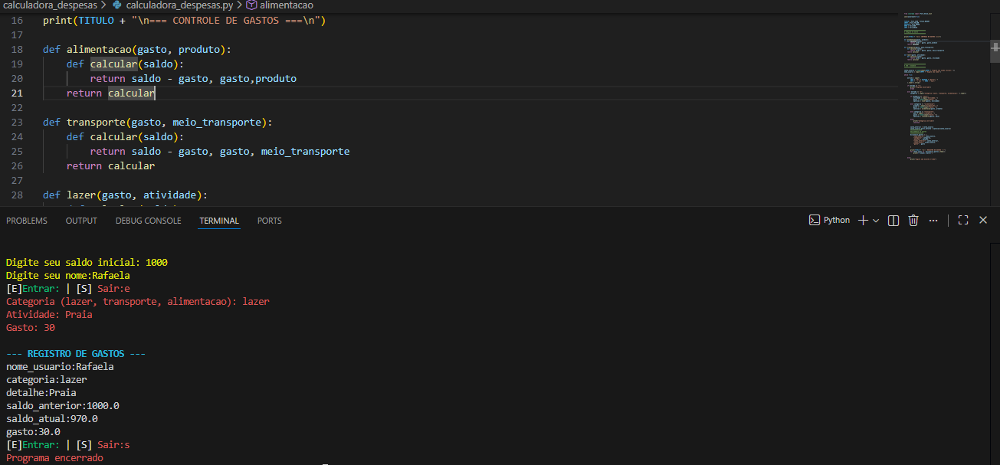

# Sistema de Gastos em Python

## Descrição do Projeto

Este projeto é um **Sistema de Controle de Gastos desenvolvido em Python**, com foco em praticar lógica de programação, funções e organização de código. A aplicação permite registrar despesas, calcular valores totais e auxiliar no controle financeiro pessoal de forma simples e didática.

O projeto foi criado com fins educacionais, sendo ideal para quem está iniciando os estudos em Python e deseja aplicar conceitos básicos em um problema real do dia a dia.

---

## Funcionalidades

* Registro de gastos
* Cálculo do total de despesas
* Organização simples e fácil de entender
* Execução via terminal

---

## Tecnologias Utilizadas

* Python

---

## Estrutura do Projeto

* `calculadora_despesas.py` – arquivo principal contendo a lógica do sistema
* `sistema_gastos_python_foto.png` – imagem ilustrativa do projeto

---

## Demonstração Visual

A imagem abaixo mostra uma visualização do funcionamento do sistema:

---

## Como Executar o Projeto

1. Certifique-se de ter o Python instalado na máquina.
2. Faça o download ou clone este repositório.
3. Execute o arquivo principal pelo terminal.

---

## Objetivo do Projeto

Este projeto tem como objetivo reforçar conceitos fundamentais de Python, como:

* Entrada e saída de dados
* Estruturas de controle
* Funções
* Organização de código

Também serve como base para futuras melhorias, como:

* Persistência de dados
* Interface gráfica ou web
* Relatórios de gastos

---

## Autora

Projeto desenvolvido por **Rafaela Sousa** com foco em aprendizado e evolução na área de desenvolvimento de software.
